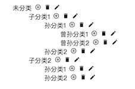

# 常用react组件

## 介绍

* 使用了[create-react-app](https://github.com/facebook/create-react-app)

* 依赖[material-ui](https://material-ui.com/)

## 如何使用

* npm install / yarn install
* npm start 启动
* npm build 编译

## 包含的组件

* 可编辑树形图
    * 所在目录：src/CateTree
    * 点击节点名toogle子节点
    * 可编辑节点名称、删除节点、添加子节点
    * 

## License
[MIT](LICENSE)
